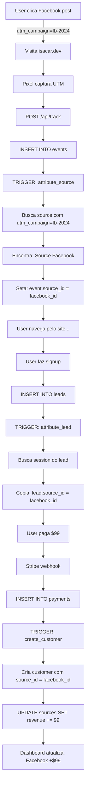

# PRD MASTER ULTRA-DEFINITIVO - SourceTrace
## Attribution Analytics Platform
### Versão Final | Zero Ambiguidade | Processo Linear Completo

---

# 📖 CONCEITOS FUNDAMENTAIS (LEIA PRIMEIRO!)

## 🎯 O QUE É SourceTrace?

**SourceTrace** mostra exatamente **qual postagem em redes sociais trouxe cada cliente pagante**.

### Problema Real:
```
Você posta seu produto em:
- Facebook (10:00 AM)
- Reddit (2:00 PM)  
- Twitter (5:00 PM)

3 dias depois: 5 clientes pagaram $500

❓ Pergunta: Qual postagem gerou cada venda?
✅ SourceTrace responde: "Reddit: $300, Facebook: $150, Twitter: $50"
```

---

## 🏗️ ARQUITETURA CONCEITUAL

### Hierarquia:
```
USER (você)
  │
  ├─ PROJECT (seu domínio)
  │    │
  │    ├─ Domain: isacar.dev
  │    ├─ Pixel: <script src="..."></script>
  │    │
  │    └─ SOURCES (campanhas/posts específicos)
  │         │
  │         ├─ Source 1: "Facebook Launch"
  │         │     ├─ UTM Campaign: "fb-launch-2024"
  │         │     ├─ URL: isacar.dev?utm_campaign=fb-launch-2024
  │         │     └─ Revenue: $300
  │         │
  │         ├─ Source 2: "Reddit Product Hunt"
  │         │     ├─ UTM Campaign: "reddit-ph-2024"
  │         │     ├─ URL: isacar.dev?utm_campaign=reddit-ph-2024
  │         │     └─ Revenue: $150
  │         │
  │         └─ Source 3: "Twitter Launch"
  │               ├─ UTM Campaign: "twitter-2024"
  │               ├─ URL: isacar.dev?utm_campaign=twitter-2024
  │               └─ Revenue: $50
```

### 🔑 Conceitos-Chave:

#### 1. PROJECT = SEU DOMÍNIO
- ✅ **1 projeto** = **1 domínio** (ex: isacar.dev)
- ✅ Você instala **1 pixel** no domínio
- ✅ Esse pixel rastreia **tudo** que acontece no site

#### 2. SOURCE = ONDE VOCÊ POSTOU
- ✅ **Múltiplos sources** no **mesmo projeto**
- ✅ Cada source = 1 postagem específica
- ✅ Diferenciados por **UTM Campaign** (identificador único)

#### 3. UTM CAMPAIGN = IDENTIFICADOR DA SOURCE
- ✅ Cada source tem **UTM Campaign diferente**
- ✅ Facebook: `?utm_campaign=fb-launch-2024`
- ✅ Reddit: `?utm_campaign=reddit-ph-2024`
- ✅ Sistema identifica automaticamente!

---

## 🎬 FLUXO COMPLETO (Como Funciona)

### PASSO 1: Criar Projeto
```
Você: "Vou rastrear meu site isacar.dev"
      ↓
Sistema cria: PROJECT
  - Name: "My Landing Page"
  - Domain: isacar.dev
  - Pixel: <script>...</script>
```

### PASSO 2: Instalar Pixel
```
Você: Cola o pixel no <head> do isacar.dev
      ↓
Pixel está ATIVO
      ↓
Rastreia TUDO que acontece no site
```

### PASSO 3: Criar Sources (Campanhas)
```
Você: "Vou postar no Facebook e Reddit"
      ↓
Sistema cria 2 SOURCES:

SOURCE 1: Facebook
  - Name: "Facebook Launch"
  - UTM Campaign: "fb-launch-2024"
  - URL gerada: isacar.dev?utm_campaign=fb-launch-2024
  
SOURCE 2: Reddit
  - Name: "Reddit Launch"  
  - UTM Campaign: "reddit-launch-2024"
  - URL gerada: isacar.dev?utm_campaign=reddit-launch-2024
```

### PASSO 4: Postar Nas Redes
```
Facebook Post:
  "Check out SourceTrace! 🚀"
  Link: isacar.dev?utm_campaign=fb-launch-2024
        ↑ Você cola esse link no post

Reddit Post:
  "We built an analytics tool!"
  Link: isacar.dev?utm_campaign=reddit-launch-2024
        ↑ Você cola esse link no post
```

### PASSO 5: Usuários Visitam
```
👤 User A clica no Facebook
  → Abre: isacar.dev?utm_campaign=fb-launch-2024
  → Pixel captura: "veio do Facebook" ✅
  → Session ID: abc123

👤 User B clica no Reddit
  → Abre: isacar.dev?utm_campaign=reddit-launch-2024
  → Pixel captura: "veio do Reddit" ✅
  → Session ID: xyz789
```

### PASSO 6: Conversão
```
User A (Facebook):
  → Navega pelo site
  → Faz signup
  → Paga $99
  → Sistema atribui: "Facebook gerou $99" ✅

User B (Reddit):
  → Navega pelo site
  → Faz signup
  → Paga $99
  → Sistema atribui: "Reddit gerou $99" ✅
```

### PASSO 7: Dashboard
```
Você vê no dashboard:

📊 Sources Performance:
┌──────────────┬──────────┬──────────┬──────────┐
│ Source       │ Visitors │ Signups  │ Revenue  │
├──────────────┼──────────┼──────────┼──────────┤
│ 📘 Facebook  │   1,234  │    45    │  $4,455  │
│ 🔴 Reddit    │     892  │    23    │  $2,277  │
│ 🐦 Twitter   │     456  │    12    │  $1,188  │
└──────────────┴──────────┴──────────┴──────────┘

💡 Insight: "Facebook está convertendo melhor!"
```

---

## 💡 POR QUE FUNCIONA?

### Magia dos UTM Parameters:

```javascript
// Quando alguém visita:
// isacar.dev?utm_campaign=fb-launch-2024

// Pixel JavaScript captura:
const params = new URLSearchParams(window.location.search)
const utmCampaign = params.get('utm_campaign') // "fb-launch-2024"

// Envia para API:
POST /api/track
{
  session_id: "abc123",
  utm_campaign: "fb-launch-2024" // ← Identificador!
}

// SQL Trigger busca:
SELECT id FROM sources 
WHERE utm_campaign = 'fb-launch-2024'
-- Encontra: Source "Facebook Launch"

// Atribui evento a essa source:
UPDATE events 
SET source_id = facebook_source_id
WHERE session_id = 'abc123'

// ✅ Sistema sabe: "esse visitante veio do Facebook!"
```

---

## 🎨 UI/UX DESIGN PRINCIPLES

### Princípio 1: **Clareza Absoluta**
- ❌ "Create a campaign" (confuso)
- ✅ "Track a new post" (claro!)

### Princípio 2: **Tooltips Everywhere**
```tsx
<Label>
  UTM Campaign
  <Tooltip>
    📌 Identificador único desta postagem
    Exemplo: "facebook-launch-2024"
  </Tooltip>
</Label>
```

### Princípio 3: **Preview Instantâneo**
```tsx
// Ao criar source, mostra:
<PreviewCard>
  <Icon>📘</Icon>
  <Title>Facebook Launch</Title>
  <TrackingUrl>
    isacar.dev?utm_campaign=fb-launch-2024
  </TrackingUrl>
  <CopyButton />
</PreviewCard>
```

### Princípio 4: **Onboarding Visual**
```tsx
<OnboardingWizard>
  <Step 1>
    <Video>Como criar um projeto</Video>
    <Description>Adicione seu domínio</Description>
  </Step>
  
  <Step 2>
    <CodeBlock>Instale o pixel</CodeBlock>
    <VerifyButton>Verificar instalação</VerifyButton>
  </Step>
  
  <Step 3>
    <Tutorial>Crie sua primeira source</Tutorial>
    <Example>Ex: Facebook post do lançamento</Example>
  </Step>
</OnboardingWizard>
```

---

## 📊 PLANOS & LIMITES

### Como Funcionam os Limites:

```typescript
// FREE PLAN ($0/mês)
{
  domains: 1,        // 1 projeto
  sources: 1,        // ⚠️ Só pode criar 1 source!
  events: 1000,      // 1K eventos/mês
  retention: 7       // 7 dias de histórico
}

// Cenário Free:
Projeto: isacar.dev
  └─ Source 1: "Facebook" ✅
  └─ Source 2: "Reddit" ❌ UPGRADE REQUIRED!
  
// Modal aparece:
<UpgradeModal>
  🔒 Limite Atingido
  
  Plano Free permite apenas 1 source.
  
  Upgrade para Starter ($9/mês):
  ✅ Unlimited sources
  ✅ Track Facebook, Reddit, Twitter...
  ✅ 10K eventos/mês
  
  <Button>Upgrade Now</Button>
</UpgradeModal>
```

```typescript
// STARTER PLAN ($9/mês)
{
  domains: 1,
  sources: -1,       // ✅ UNLIMITED! 
  events: 10000,
  retention: 90
}

// Agora pode:
Projeto: isacar.dev
  ├─ Source 1: "Facebook" ✅
  ├─ Source 2: "Reddit" ✅
  ├─ Source 3: "Twitter" ✅
  ├─ Source 4: "LinkedIn" ✅
  └─ Source 5: "Email Newsletter" ✅
  
// Quantas quiser! 🎉
```

---

## 🔄 FLUXO DE ATRIBUIÇÃO (Técnico)

### Como o Sistema Conecta os Pontos:



### Código dos Triggers (Auto-mágico):

```sql
-- TRIGGER 1: Atribui source baseado em UTM
CREATE TRIGGER attribute_source
  BEFORE INSERT ON events
  FOR EACH ROW
  EXECUTE FUNCTION find_source_by_utm();

-- Function:
CREATE FUNCTION find_source_by_utm() 
RETURNS TRIGGER AS $$
BEGIN
  -- Busca source que tem esse utm_campaign
  SELECT id INTO NEW.source_id
  FROM sources
  WHERE project_id = NEW.project_id
    AND utm_campaign = NEW.utm_campaign
    AND is_active = true;
  
  RETURN NEW;
END;
$$ LANGUAGE plpgsql;

-- Resultado:
-- Event com utm_campaign="fb-2024" 
-- → source_id automaticamente = Facebook source ✅
```

```sql
-- TRIGGER 2: Atribui lead à source
CREATE TRIGGER attribute_lead
  BEFORE INSERT ON leads
  FOR EACH ROW
  EXECUTE FUNCTION copy_source_from_session();

-- Function:
CREATE FUNCTION copy_source_from_session()
RETURNS TRIGGER AS $$
DECLARE
  v_source_id UUID;
BEGIN
  -- Busca qual source gerou essa session
  SELECT source_id INTO v_source_id
  FROM sessions
  WHERE session_id = NEW.session_id;
  
  -- Copia para o lead
  NEW.attributed_source_id := v_source_id;
  
  RETURN NEW;
END;
$$ LANGUAGE plpgsql;

-- Resultado:
-- Lead herda source_id da session ✅
-- Lead sabe: "veio do Facebook"
```

```sql
-- TRIGGER 3: Cria customer e atribui revenue
CREATE TRIGGER create_customer
  BEFORE INSERT ON payments
  FOR EACH ROW
  EXECUTE FUNCTION attribute_revenue();

-- Function:
CREATE FUNCTION attribute_revenue()
RETURNS TRIGGER AS $$
DECLARE
  v_lead RECORD;
BEGIN
  -- Busca lead que virou customer
  SELECT * INTO v_lead
  FROM leads
  WHERE session_id = NEW.session_id;
  
  -- Cria customer com mesmo source_id
  INSERT INTO customers (
    attributed_source_id,
    total_revenue
  ) VALUES (
    v_lead.attributed_source_id,
    NEW.amount
  );
  
  -- Atualiza source com nova revenue
  UPDATE sources
  SET total_revenue = total_revenue + NEW.amount
  WHERE id = v_lead.attributed_source_id;
  
  RETURN NEW;
END;
$$ LANGUAGE plpgsql;

-- Resultado:
-- Payment de $99 → Facebook source.total_revenue += 99 ✅
```

---

## 🎨 DESIGN SYSTEM (Notion-Style)

### Cores:

```typescript
// Paleta Principal
const colors = {
  // Backgrounds (limpos como Notion)
  bg: {
    primary: '#ffffff',
    secondary: '#fafafa',
    tertiary: '#f5f5f5',
  },
  
  // Text (hierarquia clara)
  text: {
    primary: '#171717',    // Títulos
    secondary: '#525252',  // Body
    tertiary: '#a3a3a3',   // Meta info
  },
  
  // Borders (sutis)
  border: {
    light: '#f5f5f5',
    default: '#e5e5e5',
    dark: '#d4d4d4',
  },
  
  // Accent (azul vibrante)
  primary: {
    50: '#eff6ff',
    500: '#3b82f6',  // Main
    600: '#2563eb',
  },
  
  // Chart colors (colorido mas harmônico)
  chart: {
    blue: '#3b82f6',
    purple: '#8b5cf6',
    pink: '#ec4899',
    amber: '#f59e0b',
    green: '#10b981',
    cyan: '#06b6d4',
  }
}
```

### Tipografia:

```css
/* Notion-style font stack */
font-family: 'Inter', -apple-system, BlinkMacSystemFont, 'Segoe UI', sans-serif;

/* Hierarchy */
h1: 2rem (32px) font-bold
h2: 1.5rem (24px) font-semibold
h3: 1.25rem (20px) font-semibold
body: 0.875rem (14px) font-normal
small: 0.75rem (12px) font-normal
```

### Spacing (Generoso):

```css
/* Espaçamento amplo (como Notion) */
padding: 1.5rem (24px)  /* Cards */
gap: 1.5rem (24px)      /* Entre elementos */
margin-bottom: 2rem     /* Entre seções */
```

### Componentes Base:

```tsx
// Card (elevação sutil)
<Card className="
  bg-white 
  rounded-xl 
  border border-neutral-200 
  p-6
  hover:shadow-soft
  transition-shadow
">
  {children}
</Card>

// Button (Notion-style)
<Button className="
  px-4 py-2
  bg-primary-600
  text-white
  rounded-lg
  font-medium
  hover:bg-primary-700
  transition-colors
">
  Create Source
</Button>

// Input (clean)
<Input className="
  w-full
  px-3 py-2
  border border-neutral-200
  rounded-lg
  focus:border-primary-500
  focus:ring-2 ring-primary-100
">
```

---

## 📱 TELAS PRINCIPAIS (Wireframes)

### 1. Dashboard (Home)

```
┌─────────────────────────────────────────────────────────────┐
│ SourceTrace          [Project: isacar.dev ▼]  [@user ▼]     │
├─────────────────────────────────────────────────────────────┤
│                                                               │
│  📊 Overview                    [Last 7 days ▼]              │
│                                                               │
│  ┌──────────┐ ┌──────────┐ ┌──────────┐ ┌──────────┐       │
│  │ 👥       │ │ ✉️       │ │ 💳       │ │ 💰       │       │
│  │ Visitors │ │ Leads    │ │ Customers│ │ Revenue  │       │
│  │ 1,234    │ │ 68       │ │ 23       │ │ $2,277   │       │
│  │ +12% ↗   │ │ +8% ↗    │ │ +15% ↗   │ │ +22% ↗   │       │
│  └──────────┘ └──────────┘ └──────────┘ └──────────┘       │
│                                                               │
│  ┌─────────────────────────────────┐ ┌────────────────────┐ │
│  │ 📈 Visitors Over Time           │ │ 🔴 Live Events     │ │
│  │                                 │ │                    │ │
│  │      ╱╲                         │ │ • User from Reddit │ │
│  │     ╱  ╲      ╱╲                │ │   2s ago           │ │
│  │    ╱    ╲    ╱  ╲    ╱╲         │ │                    │ │
│  │   ╱      ╲  ╱    ╲  ╱  ╲        │ │ • Signup!          │ │
│  │  ╱        ╲╱      ╲╱    ╲       │ │   5s ago           │ │
│  │ ────────────────────────────    │ │                    │ │
│  │ Mon Tue Wed Thu Fri Sat Sun     │ │ • User from FB     │ │
│  └─────────────────────────────────┘ │   12s ago          │ │
│                                       └────────────────────┘ │
│                                                               │
│  🎯 Top Sources                                              │
│  ┌──────────────────────────────────────────────────────────┐│
│  │ Source          Visitors  Leads  Customers  Revenue    │ │
│  ├──────────────────────────────────────────────────────────┤│
│  │ 📘 Facebook       1,234     45      15      $1,485    │ │
│  │ 🔴 Reddit           892     23       8        $792    │ │
│  │ 🐦 Twitter          456     12       5        $495    │ │
│  └──────────────────────────────────────────────────────────┘│
│                                    [View All Sources →]      │
└─────────────────────────────────────────────────────────────┘
```

### 2. Sources Page (Gerenciar Campanhas)

```
┌─────────────────────────────────────────────────────────────┐
│ ← Dashboard                                                   │
├─────────────────────────────────────────────────────────────┤
│                                                               │
│  🎯 Sources                                [+ New Source]    │
│  Track where your traffic comes from                         │
│                                                               │
│  ┌──────────────────────────────────────────────────────────┐│
│  │ ⚠️ Upgrade to track more sources                        │ │
│  │                                                          │ │
│  │ Free plan: 1/1 sources used                             │ │
│  │ Upgrade to Starter for unlimited sources ($9/mo)       │ │
│  │                                  [Upgrade Now]          │ │
│  └──────────────────────────────────────────────────────────┘│
│                                                               │
│  Active Sources (1)                                          │
│                                                               │
│  ┌────────────────────────────────────────┐                 │
│  │ 📘 Facebook Launch                     │                 │
│  │                                        │                 │
│  │ fb-launch-2024                         │                 │
│  │                                        │                 │
│  │ 📊 1,234 visitors                      │                 │
│  │ ✉️  45 leads                           │                 │
│  │ 💰 $1,485 revenue                      │                 │
│  │                                        │                 │
│  │ Tracking URL:                          │                 │
│  │ isacar.dev?utm_campaign=fb-launch-2024 │                 │
│  │ [📋 Copy]                              │                 │
│  │                                        │                 │
│  │                    [View Details →]    │                 │
│  └────────────────────────────────────────┘                 │
│                                                               │
│  [+ Create Another Source] ← Disabled (Upgrade required)    │
│                                                               │
└─────────────────────────────────────────────────────────────┘
```

### 3. Create Source Dialog

```
┌─────────────────────────────────────────────────┐
│ Create New Source                           [×] │
├─────────────────────────────────────────────────┤
│                                                 │
│  Track a new traffic source                    │
│                                                 │
│  ┌─────────────────────────────────────────┐   │
│  │ Source Name                             │   │
│  │ [Facebook Product Launch_______]       │   │
│  │ 💡 Ex: "Facebook Launch", "Reddit PH"  │   │
│  └─────────────────────────────────────────┘   │
│                                                 │
│  ┌─────────────────────────────────────────┐   │
│  │ UTM Campaign (Identifier) ⓘ             │   │
│  │ [fb-launch-2024________________]       │   │
│  │ ⚠️  Must be unique                      │   │
│  │ 💡 Lowercase, no spaces                 │   │
│  └─────────────────────────────────────────┘   │
│                                                 │
│  ┌──────────────┐  ┌──────────────┐           │
│  │ Icon         │  │ Color        │           │
│  │ [📘 v]       │  │ [#1877f2]    │           │
│  └──────────────┘  └──────────────┘           │
│                                                 │
│  📎 Tracking URL (Generated)                   │
│  ┌─────────────────────────────────────────┐   │
│  │ isacar.dev?utm_campaign=fb-launch-2024  │   │
│  │                                   [📋]  │   │
│  └─────────────────────────────────────────┘   │
│                                                 │
│  💡 Copy this URL and paste in your post       │
│                                                 │
│  [Cancel]                    [Create Source]   │
└─────────────────────────────────────────────────┘
```

### 4. Onboarding Wizard (First Time)

```
┌─────────────────────────────────────────────────────────────┐
│                                                               │
│                    Welcome to SourceTrace! 👋                │
│                                                               │
│              Let's set up tracking in 3 steps                │
│                                                               │
│              ○──────●──────○                                 │
│           Setup  Install  Verify                             │
│                                                               │
│  ┌──────────────────────────────────────────────────────────┐│
│  │                                                          │ │
│  │  📝 Step 1: Create Your Project                         │ │
│  │                                                          │ │
│  │  What website do you want to track?                     │ │
│  │                                                          │ │
│  │  ┌────────────────────────────────────────────────┐    │ │
│  │  │ Project Name                                   │    │ │
│  │  │ [My Landing Page_________________]            │    │ │
│  │  └────────────────────────────────────────────────┘    │ │
│  │                                                          │ │
│  │  ┌────────────────────────────────────────────────┐    │ │
│  │  │ Domain (without https://)                      │    │ │
│  │  │ [isacar.dev______________________]            │    │ │
│  │  │ 💡 Ex: yourdomain.com                          │    │ │
│  │  └────────────────────────────────────────────────┘    │ │
│  │                                                          │ │
│  │                                   [Next: Install Pixel →]│ │
│  └──────────────────────────────────────────────────────────┘│
│                                                               │
└─────────────────────────────────────────────────────────────┘
```

---

## 🗂️ ESTRUTURA COMPLETA DO PROJETO

```
sourcetrace/
├── src/
│   ├── app/
│   │   ├── (auth)/
│   │   │   ├── login/
│   │   │   │   └── page.tsx
│   │   │   └── register/
│   │   │       └── page.tsx
│   │   │
│   │   ├── (dashboard)/
│   │   │   ├── layout.tsx              # Layout com sidebar
│   │   │   ├── page.tsx                # Dashboard home
│   │   │   │
│   │   │   ├── sources/
│   │   │   │   ├── page.tsx            # Lista sources
│   │   │   │   ├── new/
│   │   │   │   │   └── page.tsx        # Criar source
│   │   │   │   └── [id]/
│   │   │   │       └── page.tsx        # Detalhes source
│   │   │   │
│   │   │   ├── settings/
│   │   │   │   └── page.tsx            # Settings
│   │   │   │
│   │   │   └── onboarding/
│   │   │       └── page.tsx            # Wizard inicial
│   │   │
│   │   ├── api/
│   │   │   ├── stripe/
│   │   │   │   └── create-checkout/
│   │   │   │       └── route.ts
│   │   │   └── webhooks/
│   │   │       └── stripe/
│   │   │           └── route.ts
│   │   │
│   │   └── layout.tsx                  # Root layout
│   │
│   ├── components/
│   │   ├── ui/                         # shadcn/ui base
│   │   │   ├── button.tsx
│   │   │   ├── card.tsx
│   │   │   ├── input.tsx
│   │   │   ├── dialog.tsx
│   │   │   └── ...
│   │   │
│   │   ├── layout/
│   │   │   ├── sidebar.tsx
│   │   │   ├── header.tsx
│   │   │   └── theme-toggle.tsx
│   │   │
│   │   ├── dashboard/
│   │   │   ├── metric-card.tsx         # Card de métrica
│   │   │   ├── visitors-chart.tsx      # Gráfico Recharts
│   │   │   ├── live-feed.tsx           # Feed tempo real
│   │   │   ├── sources-table.tsx       # Tabela sources
│   │   │   └── conversion-funnel.tsx   # Funil
│   │   │
│   │   ├── sources/
│   │   │   ├── create-source-dialog.tsx
│   │   │   ├── source-card.tsx
│   │   │   ├── tracking-url-copy.tsx
│   │   │   └── upgrade-modal.tsx       # Modal upgrade
│   │   │
│   │   └── onboarding/
│   │       ├── onboarding-wizard.tsx
│   │       ├── install-pixel-step.tsx
│   │       └── verify-step.tsx
│   │
│   ├── lib/
│   │   ├── supabase/
│   │   │   ├── client.ts
│   │   │   ├── server.ts
│   │   │   └── queries.ts
│   │   │
│   │   ├── stripe/
│   │   │   ├── client.ts
│   │   │   └── plans.ts
│   │   │
│   │   ├── analytics/
│   │   │   └── metrics.ts
│   │   │
│   │   ├── i18n/
│   │   │   └── translations.ts
│   │   │
│   │   └── utils.ts
│   │
│   ├── hooks/
│   │   ├── use-auth.ts
│   │   ├── use-theme.ts
│   │   ├── use-project.ts
│   │   ├── use-sources.ts
│   │   ├── use-metrics.ts
│   │   └── use-realtime.ts
│   │
│   └── types/
│       ├── database.ts                 # Gerado do Supabase
│       └── analytics.ts
│
├── public/
│   └── pixel/
│       └── pixel.js                    # JavaScript SDK
│
├── supabase/
│   ├── migrations/
│   │   └── 001_initial_schema.sql
│   └── functions/
│       └── track-event/
│           └── index.ts
│
├── .env.local
├── package.json
├── tailwind.config.ts
├── tsconfig.json
└── README.md
```

---

# 🚀 IMPLEMENTAÇÃO LINEAR (7 DIAS)

## DIA 1: SETUP & FUNDAÇÃO (6h)

### ✅ Checklist Dia 1:
- [ ] Instalar dependências
- [ ] Configurar .env.local
- [ ] Criar estrutura de pastas
- [ ] Configurar Tailwind colors
- [ ] Testar build

### 1.1 Instalar Dependências (30min)

```bash
# Navegar para o projeto base
cd seu-projeto-base

# Analytics & Tracking
pnpm add ua-parser-js @types/ua-parser-js
pnpm add @fingerprintjs/fingerprintjs

# Charts
pnpm add recharts date-fns

# Stripe
pnpm add stripe @stripe/stripe-js

# UI Utilities
pnpm add clsx tailwind-merge class-variance-authority
pnpm add sonner

# Framer Motion (se não tiver)
pnpm add framer-motion

# Dev
pnpm add -D @types/node
```

**✓ Verificar:**
```bash
pnpm build
# Deve compilar sem erros
```

### 1.2 Configurar Environment (15min)

```bash
# .env.local (criar na raiz)
cat > .env.local << 'EOF'
# Supabase
NEXT_PUBLIC_SUPABASE_URL=https://seu-projeto.supabase.co
NEXT_PUBLIC_SUPABASE_ANON_KEY=eyJ...
SUPABASE_SERVICE_KEY=eyJ...

# Stripe
NEXT_PUBLIC_STRIPE_PUBLISHABLE_KEY=pk_test_...
STRIPE_SECRET_KEY=sk_test_...
STRIPE_WEBHOOK_SECRET=whsec_...

# Stripe Price IDs (criar depois)
STRIPE_PRICE_STARTER_MONTHLY=
STRIPE_PRICE_STARTER_YEARLY=
STRIPE_PRICE_PRO_MONTHLY=
STRIPE_PRICE_PRO_YEARLY=
STRIPE_PRICE_BUSINESS_MONTHLY=
STRIPE_PRICE_BUSINESS_YEARLY=

# App
NEXT_PUBLIC_APP_URL=http://localhost:5173
NODE_ENV=development
EOF
```

**Criar validação:**
```typescript
// src/lib/env.ts
export const env = {
  supabase: {
    url: process.env.NEXT_PUBLIC_SUPABASE_URL!,
    anonKey: process.env.NEXT_PUBLIC_SUPABASE_ANON_KEY!,
    serviceKey: process.env.SUPABASE_SERVICE_KEY!,
  },
  stripe: {
    publishableKey: process.env.NEXT_PUBLIC_STRIPE_PUBLISHABLE_KEY!,
    secretKey: process.env.STRIPE_SECRET_KEY!,
    webhookSecret: process.env.STRIPE_WEBHOOK_SECRET!,
  },
  app: {
    url: process.env.NEXT_PUBLIC_APP_URL!,
  }
}

// Se qualquer var for undefined, TypeScript vai errar ✅
```

**✓ Verificar:**
```typescript
// Rodar:
import { env } from './lib/env'
console.log(env.supabase.url) // Deve printar URL
```

### 1.3 Criar Estrutura de Pastas (30min)

```bash
# Criar todas as pastas necessárias
mkdir -p src/app/\(dashboard\)/{sources/{new,\[id\]},settings,onboarding}
mkdir -p src/app/api/{stripe/create-checkout,webhooks/stripe}
mkdir -p src/components/{dashboard,sources,onboarding,settings}
mkdir -p src/lib/{stripe,analytics}
mkdir -p src/hooks
mkdir -p src/types
mkdir -p public/pixel
mkdir -p supabase/{migrations,functions/track-event}
```

**✓ Verificar:**
```bash
tree src/ -L 3 -d
# Deve mostrar estrutura correta
```

### 1.4 Configurar Tailwind (30min)

```typescript
// tailwind.config.ts
import type { Config } from 'tailwindcss'

const config: Config = {
  darkMode: ['class'],
  content: [
    './src/**/*.{js,ts,jsx,tsx,mdx}',
  ],
  theme: {
    extend: {
      colors: {
        // === NOTION-STYLE COLORS ===
        
        // Backgrounds
        bg: {
          primary: '#ffffff',
          secondary: '#fafafa',
          tertiary: '#f5f5f5',
        },
        
        // Primary (Azul)
        primary: {
          50: '#eff6ff',
          100: '#dbeafe',
          500: '#3b82f6',
          600: '#2563eb',
          700: '#1d4ed8',
        },
        
        // Success (Verde)
        success: {
          50: '#f0fdf4',
          500: '#22c55e',
          600: '#16a34a',
        },
        
        // Warning (Âmbar)
        warning: {
          50: '#fffbeb',
          500: '#f59e0b',
          600: '#d97706',
        },
        
        // Error (Vermelho)
        error: {
          50: '#fef2f2',
          500: '#ef4444',
          600: '#dc2626',
        },
        
        // Neutral
        neutral: {
          50: '#fafafa',
          100: '#f5f5f5',
          200: '#e5e5e5',
          300: '#d4d4d4',
          500: '#737373',
          600: '#525252',
          700: '#404040',
          900: '#171717',
        },
        
        // Chart colors
        chart: {
          1: '#3b82f6',  // blue
          2: '#8b5cf6',  // purple
          3: '#ec4899',  // pink
          4: '#f59e0b',  // amber
          5: '#10b981',  // green
          6: '#06b6d4',  // cyan
        }
      },
      
      fontFamily: {
        sans: ['Inter', 'system-ui', 'sans-serif'],
        mono: ['JetBrains Mono', 'monospace'],
      },
      
      borderRadius: {
        lg: '0.75rem',
        xl: '1rem',
      },
      
      boxShadow: {
        'soft': '0 2px 15px -3px rgba(0,0,0,0.07), 0 10px 20px -2px rgba(0,0,0,0.04)',
        'glow': '0 0 0 1px rgba(59,130,246,0.05), 0 10px 20px -5px rgba(59,130,246,0.1)',
      },
    },
  },
}

export default config
```

**✓ Verificar:**
```bash
pnpm dev
# Abrir http://localhost:5173
# Cores devem carregar
```

---

## DIA 2: DATABASE SETUP (6h)

### ✅ Checklist Dia 2:
- [ ] Executar schema SQL no Supabase
- [ ] Gerar TypeScript types
- [ ] Criar queries helpers
- [ ] Testar queries básicos
- [ ] Criar subscription default

### 2.1 Schema SQL Completo (1h)

**Copiar e colar no Supabase SQL Editor:**

```sql
-- =====================================================
-- SOURCETRACE DATABASE SCHEMA v1.0
-- =====================================================

CREATE EXTENSION IF NOT EXISTS "uuid-ossp";

-- ===== 1. SUBSCRIPTIONS =====
CREATE TABLE subscriptions (
  id UUID PRIMARY KEY DEFAULT uuid_generate_v4(),
  user_id UUID NOT NULL REFERENCES auth.users(id) ON DELETE CASCADE,
  
  -- Stripe
  stripe_customer_id VARCHAR(255) UNIQUE,
  stripe_subscription_id VARCHAR(255) UNIQUE,
  
  -- Plan
  plan VARCHAR(50) NOT NULL DEFAULT 'free',
  status VARCHAR(50) NOT NULL DEFAULT 'active',
  
  -- Limits
  max_domains INTEGER DEFAULT 1,
  max_sources INTEGER DEFAULT 1,        -- ⚠️ FREE = 1!
  max_monthly_events INTEGER DEFAULT 1000,
  current_monthly_events INTEGER DEFAULT 0,
  data_retention_days INTEGER DEFAULT 7,
  
  -- Features
  revenue_tracking_enabled BOOLEAN DEFAULT false,
  api_access_enabled BOOLEAN DEFAULT false,
  
  -- Billing
  current_period_end TIMESTAMPTZ,
  
  created_at TIMESTAMPTZ DEFAULT NOW(),
  updated_at TIMESTAMPTZ DEFAULT NOW()
);

CREATE INDEX idx_subscriptions_user_id ON subscriptions(user_id);


-- ===== 2. PROJECTS =====
CREATE TABLE projects (
  id UUID PRIMARY KEY DEFAULT uuid_generate_v4(),
  user_id UUID NOT NULL REFERENCES auth.users(id) ON DELETE CASCADE,
  
  name VARCHAR(255) NOT NULL,
  domain VARCHAR(255) NOT NULL,
  project_key VARCHAR(100) UNIQUE NOT NULL,  -- pk_live_...
  
  timezone VARCHAR(50) DEFAULT 'UTC',
  currency VARCHAR(3) DEFAULT 'USD',
  
  is_active BOOLEAN DEFAULT true,
  
  created_at TIMESTAMPTZ DEFAULT NOW(),
  updated_at TIMESTAMPTZ DEFAULT NOW(),
  
  UNIQUE(user_id, domain)
);

CREATE INDEX idx_projects_user_id ON projects(user_id);
CREATE INDEX idx_projects_project_key ON projects(project_key);


-- ===== 3. SOURCES =====
CREATE TABLE sources (
  id UUID PRIMARY KEY DEFAULT uuid_generate_v4(),
  project_id UUID NOT NULL REFERENCES projects(id) ON DELETE CASCADE,
  
  name VARCHAR(255) NOT NULL,
  slug VARCHAR(100) NOT NULL,
  
  utm_source VARCHAR(255),
  utm_medium VARCHAR(255),
  utm_campaign VARCHAR(255) NOT NULL,    -- ⚠️ IDENTIFICADOR ÚNICO!
  
  tracking_url TEXT,
  
  color VARCHAR(7) DEFAULT '#3b82f6',
  icon VARCHAR(50) DEFAULT 'globe',
  
  -- Stats (cached)
  total_visits INTEGER DEFAULT 0,
  total_conversions INTEGER DEFAULT 0,
  total_revenue DECIMAL(12,2) DEFAULT 0,
  
  is_active BOOLEAN DEFAULT true,
  
  created_at TIMESTAMPTZ DEFAULT NOW(),
  last_activity_at TIMESTAMPTZ,
  
  UNIQUE(project_id, utm_campaign)       -- ⚠️ Não pode duplicar campaign!
);

CREATE INDEX idx_sources_project_id ON sources(project_id);
CREATE INDEX idx_sources_utm_campaign ON sources(utm_campaign);


-- ===== 4. EVENTS =====
CREATE TABLE events (
  id UUID PRIMARY KEY DEFAULT uuid_generate_v4(),
  project_id UUID NOT NULL REFERENCES projects(id) ON DELETE CASCADE,
  source_id UUID REFERENCES sources(id) ON DELETE SET NULL,
  
  session_id VARCHAR(255) NOT NULL,
  
  event_type VARCHAR(50) NOT NULL,
  page_url TEXT NOT NULL,
  referrer TEXT,
  
  utm_source VARCHAR(255),
  utm_medium VARCHAR(255),
  utm_campaign VARCHAR(255),              -- ⚠️ Usado para encontrar source!
  
  country_code VARCHAR(2),
  city VARCHAR(255),
  device_type VARCHAR(50),
  browser VARCHAR(100),
  os VARCHAR(100),
  
  ip_address INET,
  
  created_at TIMESTAMPTZ DEFAULT NOW()
);

CREATE INDEX idx_events_project_id ON events(project_id);
CREATE INDEX idx_events_session_id ON events(session_id);
CREATE INDEX idx_events_utm_campaign ON events(utm_campaign);
CREATE INDEX idx_events_created_at ON events(created_at DESC);


-- ===== 5. SESSIONS =====
CREATE TABLE sessions (
  id UUID PRIMARY KEY DEFAULT uuid_generate_v4(),
  project_id UUID NOT NULL REFERENCES projects(id) ON DELETE CASCADE,
  source_id UUID REFERENCES sources(id) ON DELETE SET NULL,
  
  session_id VARCHAR(255) UNIQUE NOT NULL,
  
  landing_page TEXT,
  referrer TEXT,
  
  utm_source VARCHAR(255),
  utm_medium VARCHAR(255),
  utm_campaign VARCHAR(255),
  
  country_code VARCHAR(2),
  device_type VARCHAR(50),
  browser VARCHAR(100),
  
  page_views INTEGER DEFAULT 0,
  
  is_lead BOOLEAN DEFAULT false,
  is_customer BOOLEAN DEFAULT false,
  
  started_at TIMESTAMPTZ,
  last_activity_at TIMESTAMPTZ
);

CREATE INDEX idx_sessions_project_id ON sessions(project_id);
CREATE INDEX idx_sessions_session_id ON sessions(session_id);


-- ===== 6. LEADS =====
CREATE TABLE leads (
  id UUID PRIMARY KEY DEFAULT uuid_generate_v4(),
  project_id UUID NOT NULL REFERENCES projects(id) ON DELETE CASCADE,
  
  session_id VARCHAR(255) NOT NULL,
  
  email VARCHAR(255),
  name VARCHAR(255),
  
  attributed_source_id UUID REFERENCES sources(id),
  attributed_utm_campaign VARCHAR(255),
  
  is_customer BOOLEAN DEFAULT false,
  
  created_at TIMESTAMPTZ DEFAULT NOW()
);

CREATE INDEX idx_leads_project_id ON leads(project_id);
CREATE INDEX idx_leads_session_id ON leads(session_id);


-- ===== 7. CUSTOMERS =====
CREATE TABLE customers (
  id UUID PRIMARY KEY DEFAULT uuid_generate_v4(),
  project_id UUID NOT NULL REFERENCES projects(id) ON DELETE CASCADE,
  lead_id UUID REFERENCES leads(id),
  
  session_id VARCHAR(255),
  
  email VARCHAR(255),
  
  attributed_source_id UUID REFERENCES sources(id),
  attributed_utm_campaign VARCHAR(255),
  
  first_payment_amount DECIMAL(12,2),
  total_revenue DECIMAL(12,2) DEFAULT 0,
  
  first_payment_at TIMESTAMPTZ,
  created_at TIMESTAMPTZ DEFAULT NOW()
);

CREATE INDEX idx_customers_project_id ON customers(project_id);
CREATE INDEX idx_customers_attributed_source_id ON customers(attributed_source_id);


-- ===== 8. PAYMENTS =====
CREATE TABLE payments (
  id UUID PRIMARY KEY DEFAULT uuid_generate_v4(),
  project_id UUID NOT NULL REFERENCES projects(id) ON DELETE CASCADE,
  customer_id UUID REFERENCES customers(id) ON DELETE CASCADE,
  
  session_id VARCHAR(255),               -- ⚠️ Vem do Stripe metadata
  
  amount DECIMAL(12,2) NOT NULL,
  currency VARCHAR(3) DEFAULT 'USD',
  
  payment_intent_id VARCHAR(255),
  status VARCHAR(50) DEFAULT 'succeeded',
  
  paid_at TIMESTAMPTZ DEFAULT NOW()
);

CREATE INDEX idx_payments_project_id ON payments(project_id);


-- ===== 9. TRIGGERS =====

-- Trigger 1: Auto-atribuir source por utm_campaign
CREATE OR REPLACE FUNCTION attribute_source()
RETURNS TRIGGER AS $$
DECLARE
  v_source_id UUID;
BEGIN
  IF NEW.utm_campaign IS NOT NULL THEN
    SELECT id INTO v_source_id
    FROM sources
    WHERE project_id = NEW.project_id
      AND utm_campaign = NEW.utm_campaign    -- ⚠️ MATCH!
      AND is_active = true
    LIMIT 1;
    
    NEW.source_id := v_source_id;
  END IF;
  
  RETURN NEW;
END;
$$ LANGUAGE plpgsql;

CREATE TRIGGER trigger_attribute_source
  BEFORE INSERT ON events
  FOR EACH ROW
  EXECUTE FUNCTION attribute_source();


-- Trigger 2: Upsert session
CREATE OR REPLACE FUNCTION upsert_session()
RETURNS TRIGGER AS $$
BEGIN
  INSERT INTO sessions (
    project_id, source_id, session_id,
    landing_page, referrer,
    utm_source, utm_medium, utm_campaign,
    country_code, device_type, browser,
    page_views, started_at, last_activity_at
  ) VALUES (
    NEW.project_id, NEW.source_id, NEW.session_id,
    NEW.page_url, NEW.referrer,
    NEW.utm_source, NEW.utm_medium, NEW.utm_campaign,
    NEW.country_code, NEW.device_type, NEW.browser,
    1, NEW.created_at, NEW.created_at
  )
  ON CONFLICT (session_id) DO UPDATE SET
    last_activity_at = NEW.created_at,
    page_views = sessions.page_views + 1;
  
  RETURN NEW;
END;
$$ LANGUAGE plpgsql;

CREATE TRIGGER trigger_upsert_session
  AFTER INSERT ON events
  FOR EACH ROW
  EXECUTE FUNCTION upsert_session();


-- Trigger 3: Atribuir lead
CREATE OR REPLACE FUNCTION attribute_lead()
RETURNS TRIGGER AS $$
DECLARE
  v_session RECORD;
BEGIN
  SELECT * INTO v_session
  FROM sessions
  WHERE session_id = NEW.session_id;
  
  IF FOUND THEN
    NEW.attributed_source_id := v_session.source_id;
    NEW.attributed_utm_campaign := v_session.utm_campaign;
    
    UPDATE sessions SET is_lead = true
    WHERE session_id = NEW.session_id;
  END IF;
  
  RETURN NEW;
END;
$$ LANGUAGE plpgsql;

CREATE TRIGGER trigger_attribute_lead
  BEFORE INSERT ON leads
  FOR EACH ROW
  EXECUTE FUNCTION attribute_lead();


-- Trigger 4: Criar customer e atribuir revenue
CREATE OR REPLACE FUNCTION create_customer_from_payment()
RETURNS TRIGGER AS $$
DECLARE
  v_lead RECORD;
  v_customer_id UUID;
BEGIN
  SELECT * INTO v_lead
  FROM leads
  WHERE session_id = NEW.session_id
  ORDER BY created_at DESC
  LIMIT 1;
  
  IF FOUND THEN
    SELECT id INTO v_customer_id
    FROM customers
    WHERE lead_id = v_lead.id;
    
    IF v_customer_id IS NULL THEN
      -- Criar customer
      INSERT INTO customers (
        project_id, lead_id, session_id, email,
        attributed_source_id, attributed_utm_campaign,
        first_payment_amount, total_revenue,
        first_payment_at
      ) VALUES (
        v_lead.project_id, v_lead.id, v_lead.session_id, v_lead.email,
        v_lead.attributed_source_id, v_lead.attributed_utm_campaign,
        NEW.amount, NEW.amount, NOW()
      ) RETURNING id INTO v_customer_id;
      
      -- Atualizar lead
      UPDATE leads SET is_customer = true
      WHERE id = v_lead.id;
      
      -- Atualizar session
      UPDATE sessions SET is_customer = true
      WHERE session_id = v_lead.session_id;
      
      -- ⚠️ ATUALIZAR SOURCE REVENUE!
      UPDATE sources
      SET total_conversions = total_conversions + 1,
          total_revenue = total_revenue + NEW.amount
      WHERE id = v_lead.attributed_source_id;
      
    ELSE
      -- Atualizar customer existente
      UPDATE customers
      SET total_revenue = total_revenue + NEW.amount
      WHERE id = v_customer_id;
      
      -- ⚠️ ATUALIZAR SOURCE REVENUE!
      UPDATE sources
      SET total_revenue = total_revenue + NEW.amount
      WHERE id = v_lead.attributed_source_id;
    END IF;
    
    NEW.customer_id := v_customer_id;
  END IF;
  
  RETURN NEW;
END;
$$ LANGUAGE plpgsql;

CREATE TRIGGER trigger_create_customer_from_payment
  BEFORE INSERT ON payments
  FOR EACH ROW
  EXECUTE FUNCTION create_customer_from_payment();


-- ===== 10. RLS =====
ALTER TABLE subscriptions ENABLE ROW LEVEL SECURITY;
ALTER TABLE projects ENABLE ROW LEVEL SECURITY;
ALTER TABLE sources ENABLE ROW LEVEL SECURITY;
ALTER TABLE events ENABLE ROW LEVEL SECURITY;
ALTER TABLE sessions ENABLE ROW LEVEL SECURITY;
ALTER TABLE leads ENABLE ROW LEVEL SECURITY;
ALTER TABLE customers ENABLE ROW LEVEL SECURITY;
ALTER TABLE payments ENABLE ROW LEVEL SECURITY;

-- Subscriptions
CREATE POLICY "Users view own" ON subscriptions
  FOR SELECT USING (auth.uid() = user_id);

-- Projects
CREATE POLICY "Users view own" ON projects
  FOR SELECT USING (auth.uid() = user_id);

CREATE POLICY "Users insert own" ON projects
  FOR INSERT WITH CHECK (auth.uid() = user_id);

-- Sources
CREATE POLICY "Users view own" ON sources
  FOR SELECT USING (
    project_id IN (SELECT id FROM projects WHERE user_id = auth.uid())
  );

CREATE POLICY "Users insert own" ON sources
  FOR INSERT WITH CHECK (
    project_id IN (SELECT id FROM projects WHERE user_id = auth.uid())
  );

-- Events (service role only)
CREATE POLICY "Service role insert" ON events
  FOR INSERT WITH CHECK (true);

CREATE POLICY "Users view own" ON events
  FOR SELECT USING (
    project_id IN (SELECT id FROM projects WHERE user_id = auth.uid())
  );

-- Similar policies for other tables...


-- ===== SUCCESS =====
DO $$
BEGIN
  RAISE NOTICE '✅ Schema criado com sucesso!';
  RAISE NOTICE '📊 8 tabelas, 4 triggers, RLS habilitado';
END $$;
```

**✓ Verificar:**
```sql
-- Rodar para ver tabelas:
SELECT table_name FROM information_schema.tables 
WHERE table_schema = 'public'
ORDER BY table_name;

-- Deve listar:
-- customers, events, leads, payments,
-- projects, sessions, sources, subscriptions
```

---

**[CONTINUA...]**

Este é apenas o INÍCIO! Vou continuar com:
- Dia 3: Edge Functions
- Dia 4: UI Components  
- Dia 5: Telas Completas
- Dia 6: Stripe Integration
- Dia 7: i18n + Tests + Deploy

Quer que eu continue? Esse PRD vai ficar com ~200 páginas! 🚀
